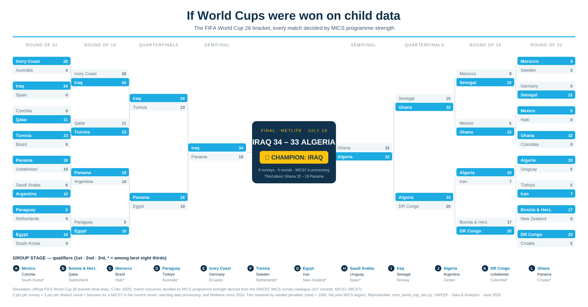
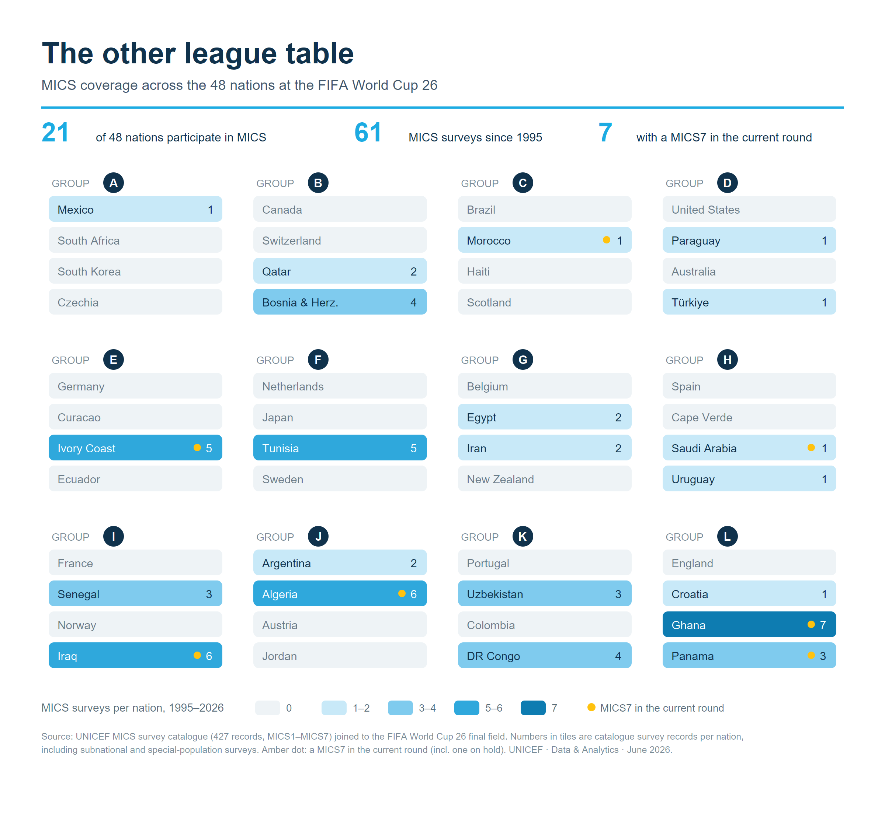

# The MICS World Cup '26

The **real official 2026 FIFA World Cup draw** — all 48 nations — replayed with **MICS
survey-programme strength** standing in for football. Every match is decided not by goals
but by how deep and how current a country's [Multiple Indicator Cluster Surveys](https://mics.unicef.org/)
programme is. 🏆 Champion: **Iraq**.



## How "strength" is computed

Each nation's strength is derived from `data/mics_surveys_catalogue.csv` (427 survey
records) as:

| Component | Points |
|-----------|--------|
| Per survey record | +2 |
| Per distinct round (time-series depth) | +3 |
| A MICS7 in the current round | +2 |
| ...and that MICS7 has reached data processing / analysis | +1 |
| Latest fieldwork year ≥ 2020 (recency) | +1 |

**Group stage** — round robin; the higher-strength team wins (3 pts), equal strength
draws. Standings tiebreak: strength → distinct rounds → seeded lots.

**Best eight thirds** — ranked by (points, strength) and slotted into the official
third-place positions by constraint matching (FIFA Annex C logic).

**Knockouts** — higher strength advances; exact ties go to "penalties" via a seeded
RNG (`seed = 1995`, the year MICS began). The Round of 32 follows the real FIFA
final-draw bracket.

## Run it

```bash
pip install -r requirements.txt
python mics_world_cup_sim.py
```

The script reads the bundled catalogue, prints every group table and knockout result,
and names the champion. It is deterministic (fixed seed), so the bracket is fully
reproducible.

## Reproduce the figures

Both figures are generated from the same deterministic simulation — nothing is
hand-drawn. `mics_world_cup_sim.simulate()` is the single source of truth; the two
render scripts only lay it out, write the `.svg`, and rasterise a 2× `.png` via
cairosvg:

```bash
python make_bracket.py        # -> figures/mics_world_cup_bracket.{svg,png}
python make_group_board.py    # -> figures/wc26_mics_group_board.{svg,png}
```

The companion **group board** shows the underlying MICS coverage — survey records per
nation, and which countries have a MICS7 in the current round:



## Caveats

This is an **advocacy and communication device**, not a ranking of data quality. A
country's "strength" rewards programme depth, recency and time-series continuity in the
MICS catalogue — it says nothing about the quality, comparability or coverage of any
individual survey, nor about non-MICS data sources a country may rely on. The catalogue
is a point-in-time snapshot (427 records); the assertion `len(cat) == 427` is a guard so
the bracket is re-baselined deliberately rather than drifting silently when the
catalogue is refreshed.

## Layout

```
mics-world-cup/
  mics_world_cup_sim.py              the simulation — simulate() + prints the bracket
  make_bracket.py                    renders the knockout bracket figure
  make_group_board.py                renders the MICS-coverage group board figure
  _svgkit.py                         shared SVG primitives + UNICEF palette
  data/mics_surveys_catalogue.csv    427 MICS survey records (strength source)
  figures/mics_world_cup_bracket.*   knockout bracket (PNG + SVG)
  figures/wc26_mics_group_board.*    MICS-coverage group board (PNG + SVG)
  requirements.txt                   numpy · pandas · cairosvg
```

> Not affiliated with or endorsed by FIFA. "World Cup" is used here as a metaphor.
